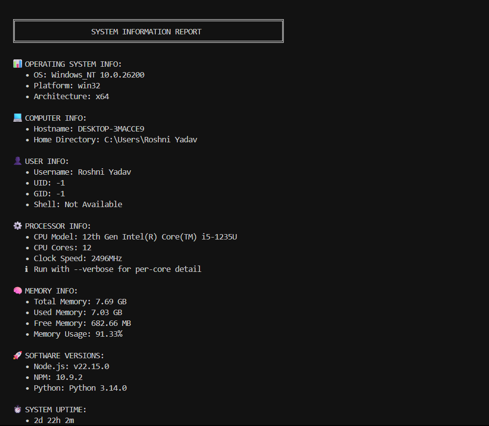
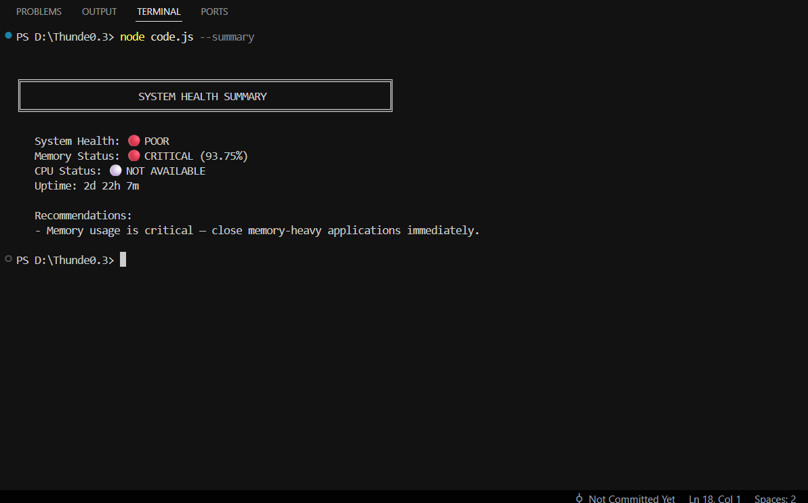
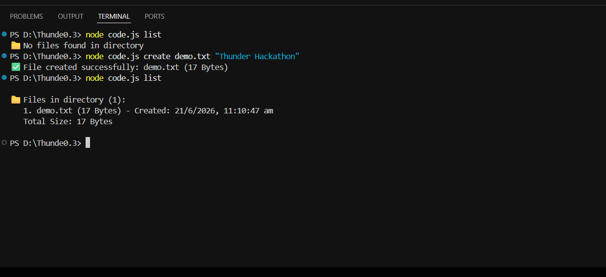
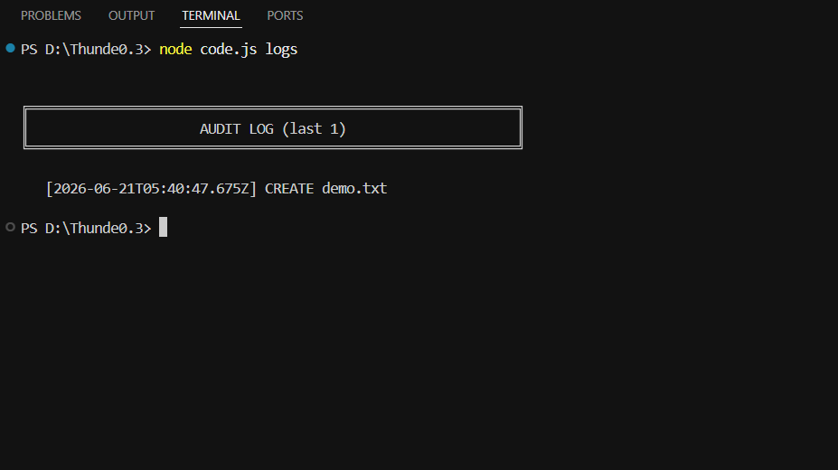

# 🚀 Thunder Hackathon 3.0 Submission

Thunder System Toolkit is a secure Node.js CLI application that collects system information, inspects environment variables, exports reports in JSON format, and performs secure CRUD operations on files inside a sandboxed workspace.

Built entirely using Node.js core modules (`os`, `fs`, `path`, `crypto`, `child_process`) with **zero external dependencies**.


---

# ✨ Features

## 🖥 System Information

Collect and display comprehensive system details:

* **Operating System Details** - OS type, version, platform, architecture
* **Hostname & Home Directory** - System identification
* **User Information** - Username, UID, GID, shell
* **CPU Information** - Model, core count, clock speed, per-core details (with `--verbose`)
* **Memory Statistics** - Total, used, free memory with usage percentage
* **System Uptime** - Formatted as days, hours, minutes
* **Node.js Version** - Runtime environment info
* **NPM Version** - Package manager version
* **Python Version** - Python installation detection
* **Network Interfaces** - IPv4, IPv6, MAC addresses

## 🏥 Health Analysis

Smart system health monitoring with actionable recommendations:

* **Memory Status** - Healthy, Warning (≥75%), or Critical (≥90%)
* **CPU Load Analysis** - Normal, Elevated, or High (Linux/macOS)
* **CPU Status** - Shows "Not Available" clearly on Windows
* **System Health Verdict** - GOOD 🟢 / FAIR 🟡 / POOR 🔴
* **Smart Recommendations** - Based on current system state
* **Uptime Monitoring** - Suggests restart after 7+ days

### Example Health Output
```
System Health: 🟢 GOOD
Memory Status: 🟡 WARNING (78.50%)
CPU Status: ⚪ NOT AVAILABLE (Windows)
Recommendations:
- Close unused applications to free up memory.
```

## 🔐 Environment Variable Inspection

* Safe allowlisted environment variables (PATH, HOME, USER, SHELL, LANG, NODE_ENV, PWD)
* Optional full environment dump with `--env-all`
* Automatic secret masking for sensitive values (passwords, tokens, API keys, etc.)
* Clear "Not Set" vs actual values
* Graceful fallback handling
* Redaction of sensitive keys matching patterns: token, password, secret, key, auth, credential, cert, private, oauth, etc.

### Secret Masking Example
```
Sensitive values are automatically masked:
✅ TOKEN: sk_live_****...****
✅ PASSWORD: ****
✅ API_KEY: sk****...****
```

## 📁 File Manager (CRUD Operations)

Sandboxed file operations with security:

* **Create Files** - New files with optional content
* **Read Files** - Display file contents
* **Update Files** - Modify existing files with auto-backup
* **Delete Files** - Remove files safely
* **List Files** - View all files with size and creation date
* **Copy Files** - Duplicate files (refuses to overwrite)
* **Rename Files** - Change file names (refuses to overwrite)
* **Search Files** - Case-insensitive filename search
* **File Statistics** - Size, timestamps, permissions
* **File Hashing** - SHA-256, SHA-512, and MD5 digests

### Automatic Backups
```
📦 Backup created: .backups/myfile.txt.bak.1718917398905
```

## 📊 JSON Export & Reporting

Export complete system reports:

```bash
# Default filename (systemInfo.json)
node code.js --save-json

# Custom filename
node code.js --save-json myreport.json

# Full system + process + network report
node code.js report
```

Supports both human-readable CLI output and machine-readable JSON output for integration with other tools.

## 📋 Audit Logging

Track all operations:

```bash
node code.js logs          # Show audit log entries
node code.js history       # Show command history
```

---

# 🏗 Architecture

```text
User Input (CLI)
     │
     ▼
SystemInfoCollector Class
     │
     ├─── System Information Module
     │      ├─ OS Information (safeGetOSType, etc.)
     │      ├─ CPU Information (safeGetCpuCores, etc.)
     │      ├─ Memory Information (safeGetTotalMemory, etc.)
     │      ├─ User Information (safeGetUserInfo)
     │      └─ Environment Variables (safe & full)
     │
     ├─── File Manager Module
     │      ├─ CRUD Operations (create, read, update, delete)
     │      ├─ File Search & List
     │      ├─ File Statistics & Hashing
     │      └─ Validation & Backup
     │
     ├─── Health Analyzer Module
     │      ├─ Memory Status Check
     │      ├─ CPU Load Monitoring
     │      ├─ Uptime Analysis
     │      └─ Smart Recommendations
     │
     └─── Display & Output Module
            ├─ Formatted CLI Output
            ├─ JSON Output
            └─ Report Generation
```

---

# ⚙ Code Flow

```text
process.argv (Command Line Arguments)
     │
     ▼
main() - Entry Point
     │
     ├─── Parse Arguments
     │      ├─ Extract --json flag
     │      ├─ Extract --verbose/-v flag
     │      └─ Identify command
     │
     ├─── Initialize SystemInfoCollector
     │      └─ Detect verbose mode
     │
     ▼
dispatchCommand() - Route to Handler
     │
     ├─── System Info Commands
     │      ├─ --all (full report)
     │      ├─ --os (OS details)
     │      ├─ --cpu (CPU info)
     │      ├─ --memory (memory stats)
     │      ├─ --summary (health analysis)
     │      └─ --network (network info)
     │
     ├─── File Manager Commands
     │      ├─ create, read, update, delete
     │      ├─ rename, copy, search
     │      └─ stats, hash
     │
     └─── Output
            ├─ formatOutput (CLI display)
            └─ --json (machine-readable JSON)
```

---

# 📂 Project Structure

```text
thunder-system-toolkit/
│
├── code.js                          # Main application (v3.2.0 polished)
├── README.md                        # This file
├── package.json                     # (optional, lists no dependencies)
│
├── collected_files/                 # Sandboxed workspace for CRUD
│   ├── .backups/                   # Automatic backup directory
│   ├── logs.txt                    # Audit log
│   ├── history.txt                 # Command history
│   └── [user files]                # User-created files
│
└── documentation/
    ├── POLISH_PASS_REPORT.md       # Polish pass details
    ├── TECHNICAL_CHANGES.md        # Technical improvements
    └── TEST_RESULTS.txt            # Test suite results
```

---

# 🚀 Quick Start

### Installation

```bash
# Clone the repository
git clone https://github.com/Roshniyadav876/thunder-system-toolkit.git
cd thunder-system-toolkit

# Run the application
node code.js --help
```

### First Run

```bash
# See complete system information
node code.js --all

# Check system health with recommendations
node code.js --summary

# Get JSON output
node code.js --all --json
```

---

# 📋 Command Reference

## System Information Commands

### All Information
```bash
node code.js --all                 # Complete system report
node code.js --all --json          # JSON format
node code.js --all --verbose       # Detailed output (per-core CPU, full PATH)
```

### Specific Information
```bash
node code.js --os                  # Operating System details
node code.js --cpu                 # CPU information (per-core with -v)
node code.js --memory              # Memory statistics
node code.js --node                # Node.js, NPM, Python versions
node code.js --user                # User information (UID, GID, shell)
node code.js --network             # Network interfaces (IPv4, IPv6, MAC)
node code.js --process             # Process information (PID, memory, uptime)
```

### Environment Variables
```bash
node code.js --env                 # Allowlisted environment variables
node code.js --env-all             # ALL variables (sensitive values masked)
```

### Health & Summary
```bash
node code.js --summary             # Health analysis with recommendations ⭐
node code.js --summary --json      # Health analysis in JSON
```

### Export & Reporting
```bash
node code.js --save-json           # Save to systemInfo.json
node code.js --save-json custom.json   # Save to custom file
node code.js report                # Complete system report
```

## File Manager Commands

### CRUD Operations
```bash
# Create
node code.js create myfile.txt "Hello World"
node code.js create empty.txt          # Empty file

# Read
node code.js read myfile.txt

# Update
node code.js update myfile.txt "New content"
node code.js update myfile.txt --empty  # Clear file

# Delete
node code.js delete myfile.txt

# List
node code.js list                  # List all files with stats

# Rename
node code.js rename oldname.txt newname.txt

# Copy
node code.js copy source.txt dest.txt

# Search
node code.js search keyword        # Case-insensitive search

# Statistics
node code.js stats myfile.txt      # Size, timestamps, permissions

# Hashing
node code.js hash myfile.txt       # SHA-256, SHA-512, MD5
```

## Activity Tracking
```bash
node code.js logs                  # Show audit log
node code.js history               # Show command history
```

## Help & Version
```bash
node code.js --help                # Show this help
node code.js -h                    # Short form
node code.js --version             # Show version
```

---

# 🛡 Security Features

### Path Traversal Protection

Blocked attempts:
```
❌ ../../secret.txt
❌ ../../../etc/passwd
❌ /etc/passwd
❌ C:\Windows\System32
```

Allowed:
```
✅ myfile.txt
✅ data-2024.json
✅ report_final.txt
```

### Filename Validation

**Allowed characters:**
- Alphanumeric: a-z, A-Z, 0-9
- Special: `.`, `_`, `-`
- Must start and end with alphanumeric
- Max 255 characters

**Blocked examples:**
```
❌ ..file          (leading dots)
❌ file..txt       (double dots)
❌ my file.txt     (spaces)
❌ CON, NUL, PRN   (Windows reserved)
```

### Sandboxed File Operations

All CRUD operations restricted to:
```
./collected_files/
```

The application **cannot**:
- Access parent directories
- Read system files
- Write outside sandbox
- Execute arbitrary code
- Access secrets

### Secret Masking

Automatic masking of sensitive environment variables:

```javascript
Patterns matched:
token, password, passwd, pwd, secret, key, auth,
credential, cred, cert, private, askpass, ipc,
session, api, access, bearer, oauth, refresh
```

**Display:**
```
TOKEN: sk_live_****...****        (short secrets fully masked)
API_KEY: sk_live****...****key    (long secrets partially masked)
PASSWORD: ****                    (≤8 chars fully masked)
```

### File Content Validation

- Maximum file size: 10 MB
- Content encoding: UTF-8
- Automatic trim of null values
- Size check before write

### Error Handling Strategy

Implemented protections:
```
✅ Safe getters with fallback values
✅ Individual try/catch blocks
✅ Validation before operations
✅ Global exception handler
✅ Unhandled rejection handler
✅ File existence verification
✅ Content size validation
✅ Permission checking
```

---

# 📸 Screenshots

## 🖥 System Information


## 🏥 Health Summary


## 📁 File Management (CRUD)


## 📋 Audit Logs & History


## 📊 JSON Export & Reporting


---

# 📸 Usage Examples

## Example 1: Full System Report
```bash
$ node code.js --all

╔════════════════════════════════════════════════════════╗
║         SYSTEM INFORMATION REPORT                      ║
╚════════════════════════════════════════════════════════╝

📊 OPERATING SYSTEM INFO:
   • OS: Linux 5.15.0
   • Platform: linux
   • Architecture: x64

💻 COMPUTER INFO:
   • Hostname: myserver
   • Home Directory: /home/user

⚙️  PROCESSOR INFO:
   • CPU Model: Intel(R) Core(TM) i7-9700K
   • CPU Cores: 8
   • Clock Speed: 3600MHz

🧠 MEMORY INFO:
   • Total Memory: 16 GB
   • Used Memory: 8.5 GB
   • Free Memory: 7.5 GB
   • Memory Usage: 53.13%

📅 Timestamp: 2024-06-21T10:30:45.123Z
```

## Example 2: Health Summary (with Recommendations)
```bash
$ node code.js --summary

╔════════════════════════════════════════════════════════╗
║         SYSTEM HEALTH SUMMARY                          ║
╚════════════════════════════════════════════════════════╝

   System Health: 🟢 GOOD
   Memory Status: 🟡 WARNING (78.50%)
   CPU Status: ⚪ NOT AVAILABLE
   Uptime: 15d 3h 45m

   Recommendations:
   - Close unused applications to free up memory.
```

## Example 3: Environment Variables (with Secret Masking)
```bash
$ node code.js --env-all --json

{
  "PATH": "/usr/local/bin:/usr/bin:/bin:...",
  "HOME": "/home/user",
  "USER": "john",
  "API_TOKEN": "sk_live_****...****",      ← MASKED
  "DATABASE_PASSWORD": "****",              ← FULLY MASKED
  "NODE_ENV": "production"
}
```

## Example 4: File Operations
```bash
$ node code.js create notes.txt "My notes"
✅ File created successfully: notes.txt (8 Bytes)

$ node code.js read notes.txt
✅ File read successfully: notes.txt (8 Bytes)
──────────────────────────────────────
My notes
──────────────────────────────────────

$ node code.js update notes.txt "Updated notes"
📦 Backup created: .backups/notes.txt.bak.1718917398905
✅ File updated successfully: notes.txt (14 Bytes)
```

## Example 5: Verbose Mode (Full Details)
```bash
$ node code.js --cpu --verbose

⚙️  PROCESSOR INFO:
   • CPU Model: Intel(R) Core(TM) i7-9700K
   • CPU Cores: 8
   • Clock Speed: 3600MHz
   • Per-core detail:
      - Core 0: Intel(R) Core(TM) i7-9700K @ 3600MHz
      - Core 1: Intel(R) Core(TM) i7-9700K @ 3600MHz
      - Core 2: Intel(R) Core(TM) i7-9700K @ 3600MHz
      [... more cores ...]
```

---

# 💡 Design Decisions

### Modular Architecture
- Information collection and presentation are decoupled
- Single `SystemInfoCollector` class generates all data
- CLI commands control display format
- New features can be added without breaking existing code

### Security First
- Path traversal protection
- Filename validation before operations
- Sandboxed file access
- Automatic secret masking
- Input validation at every step

### Graceful Degradation
- Safe getters with fallback values
- Platform-specific features handled (CPU load on Linux/macOS only)
- Missing programs don't crash (Python, NPM detection)
- Clear messaging for unavailable features

### User Experience
- Helpful error messages
- Status icons (✅, ❌, ⚠️)
- Colored output (🟢, 🟡, 🔴)
- Clear "Not Available" messages instead of "Unknown"
- Rich formatting with boxes and emojis


---

# 🏆 Hackathon Objective Mapping

| Requirement | Status | Notes |
|---|---|---|
| System Information Collection | ✅ | Comprehensive OS, CPU, memory, user info |
| Environment Variables | ✅ | Safe inspection with secret masking |
| CRUD Operations | ✅ | Full file management with validation |
| Structured Output | ✅ | Formatted CLI and JSON export |
| JSON Export | ✅ | --save-json and --report commands |
| Error Handling | ✅ | Safe getters, validation, global handlers |
| Validation | ✅ | Filename, content, path traversal checks |
| Documentation | ✅ | Comprehensive README with examples |
| Security | ✅ | Sandboxed, masked, validated |
| Code Quality | ✅ | Modular, tested, maintainable |

---

# 🔮 Future Enhancements

* Advanced network monitoring with connection tracking
* Process monitoring and management
* Advanced file search with regex support
* File comparison tools
* System performance trending
* Health monitoring dashboard
* Live system monitoring with websockets
* Configuration file support
* Plugin system for extensions

---

# 📚 Documentation Files

- **README.md** - This file (user guide)
- **POLISH_PASS_REPORT.md** - Detailed polish improvements
- **TECHNICAL_CHANGES.md** - Code changes and impact
- **TEST_RESULTS.txt** - Full test suite results

---

# 🎯 Project Goals

This project demonstrates:

✅ **Information Gathering** - Efficient system data collection  
✅ **Security** - Multiple layers of protection  
✅ **Validation** - Input and output validation  
✅ **Error Handling** - Graceful degradation  
✅ **CLI Design** - User-friendly interface  
✅ **Structured Reporting** - JSON and formatted output  
✅ **Code Quality** - Modular, tested, maintainable  

---

# 📄 License & Attribution

Created for **Thunder Hackathon 3.0** as an educational and demonstration project using Node.js.

**Technology Stack:**
- Node.js v14+ (core modules only)
- No external dependencies
- Cross-platform (Windows, Linux, macOS)

**Author:** Roshni Yadav  
**Repository:** https://github.com/Roshniyadav876/thunder-system-toolkit  
**Version:** 3.2.0  
**Status:** ✅ Hackathon Ready

---

# 🤝 Support

For issues or questions:
1. Check the command help: `node code.js --help`
2. Review examples above
3. Check test results in documentation
4. Review error messages for guidance

---

**Made with ❤️ for Thunder Hackathon 3.0**