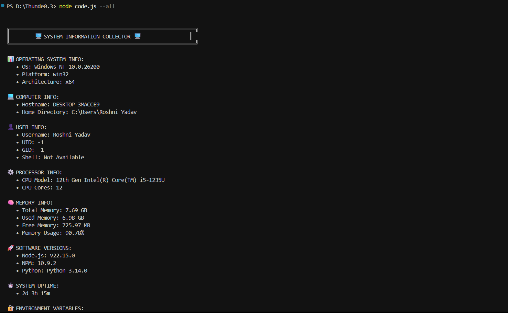
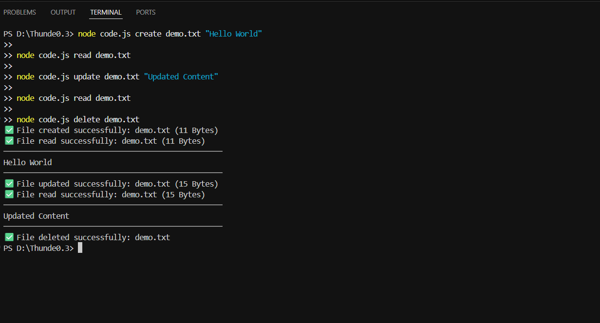
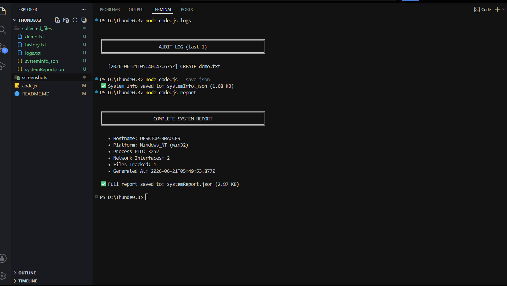

# 🚀 Thunder System Toolkit

### Thunder Hackathon 3.0 Submission

Thunder System Toolkit is a secure Node.js CLI application that collects system information, inspects environment variables, exports reports in JSON format, and performs secure CRUD operations on files inside a sandboxed workspace.

Built entirely using Node.js core modules (`os`, `fs`, `path`, `child_process`) with **zero external dependencies**.

---

# ✨ Features

## 🖥 System Information

Collect and display:

* Operating System Details
* OS Version
* Platform & Architecture
* Hostname
* User Information
* Home Directory
* CPU Model & Core Count
* Memory Usage Statistics
* System Uptime
* Node.js Version
* NPM Version
* Python Version

## 🔐 Environment Variable Inspection

* Safe allowlisted environment variables
* Optional full environment dump
* Secret masking for sensitive values
* Graceful fallback handling

## 📁 File Manager (CRUD)

* Create Files
* Read Files
* Update Files
* Delete Files
* List Files
* Automatic Backup Creation (`.bak`)
* Filename Validation
* File Size Validation

## 📊 JSON Export

Export complete system reports:

```bash
node code.js --save-json
```

Custom output file:

```bash
node code.js --save-json report.json
```

Supports both human-readable CLI output and machine-readable JSON output.

---

# 🏗 Architecture

```text
User
 │
 ▼
CLI Interface
 │
 ├── System Information Module
 │      ├── OS Information
 │      ├── CPU Information
 │      ├── Memory Information
 │      ├── User Information
 │      └── Environment Variables
 │
 └── File Manager Module
        ├── Create
        ├── Read
        ├── Update
        ├── Delete
        └── List
```

---

# ⚙ Code Flow

```text
process.argv
     │
     ▼
main()
     │
     ▼
Command Dispatcher
     │
 ┌───┴───────────┐
 ▼               ▼
System Info      File Manager
Module           Module
 │               │
 ▼               ▼
Formatted Output / JSON Output
```

---

# 📂 Project Structure

```text
thunder-system-toolkit/
│
├── code.js
├── README.md
│
├── screenshots/
│   ├── system-report.png
│   ├── crud-demo.png
│   └── json-export.png
│
└── collected_files/
```

---

# 🚀 Installation

Clone the repository:

```bash
git clone https://github.com/Roshniyadav876/thunder-system-toolkit.git
```

Move into the project directory:

```bash
cd thunder-system-toolkit
```

Run the application:

```bash
node code.js --help
```

---

# 📋 Command Reference

## System Information Commands

```bash
node code.js --all
node code.js --os
node code.js --cpu
node code.js --memory
node code.js --node
node code.js --env
node code.js --env-all
node code.js --user
node code.js --summary
node code.js --save-json
```

JSON Output:

```bash
node code.js --memory --json
```

## File Manager Commands

```bash
node code.js create <filename> [content]
node code.js read <filename>
node code.js update <filename> <content>
node code.js delete <filename>
node code.js list
```

---

# 🛡 Security Features

### Path Traversal Protection

Blocked examples:

```text
../../file.txt
../secret.txt
```

### Filename Validation

Allowed characters:

```text
a-z
A-Z
0-9
.
_
-
```

### Sandboxed File Operations

All CRUD operations are restricted to:

```text
./collected_files
```

The application cannot access files outside the sandboxed directory.

### Secret Masking

Sensitive environment variables are automatically masked:

```text
PASSWORD
TOKEN
SECRET
KEY
AUTH
PRIVATE
```

---

# ⚠ Error Handling Strategy

Implemented protections:

* Safe getters with fallback values
* Individual try/catch blocks
* Validation before file operations
* Global exception handling
* Unhandled promise rejection handling
* File existence verification
* Content size validation

This ensures the application remains stable even when individual operations fail.

---

# 📸 Screenshots

## Full System Information Report



## CRUD Operations Demo



## JSON Export Demo



---

# 💡 Design Decisions

* Information collection and presentation are decoupled.
* A single collector object generates all system information.
* CLI commands control which data is displayed.
* New commands can be added without affecting existing functionality.
* Security and validation are enforced before filesystem access.

---

# 🏆 Hackathon Objective Mapping

| Requirement                   | Status |
| ----------------------------- | ------ |
| System Information Collection | ✅      |
| Environment Variables         | ✅      |
| CRUD Operations               | ✅      |
| Structured Output             | ✅      |
| JSON Export                   | ✅      |
| Error Handling                | ✅      |
| Validation                    | ✅      |
| Documentation                 | ✅      |
| Code Flow Explanation         | ✅      |
| Security Considerations       | ✅      |

---

# 🔮 Future Enhancements

* Network Information Monitoring
* Process Information Monitoring
* File Search
* File Statistics
* File Rename & Copy
* Health Monitoring Dashboard
* Live System Monitoring

---

# 🎯 Hackathon Objective

This project was developed for Thunder Hackathon 3.0 to demonstrate secure system information collection, environment variable inspection, JSON reporting, and sandboxed file management using Node.js.

The solution focuses on:

- Information gathering
- Security
- Validation
- Error handling
- Clean CLI design
- Structured reporting

---

# 📄 License

Created for **Thunder Hackathon 3.0** as an educational and demonstration project using Node.js.

